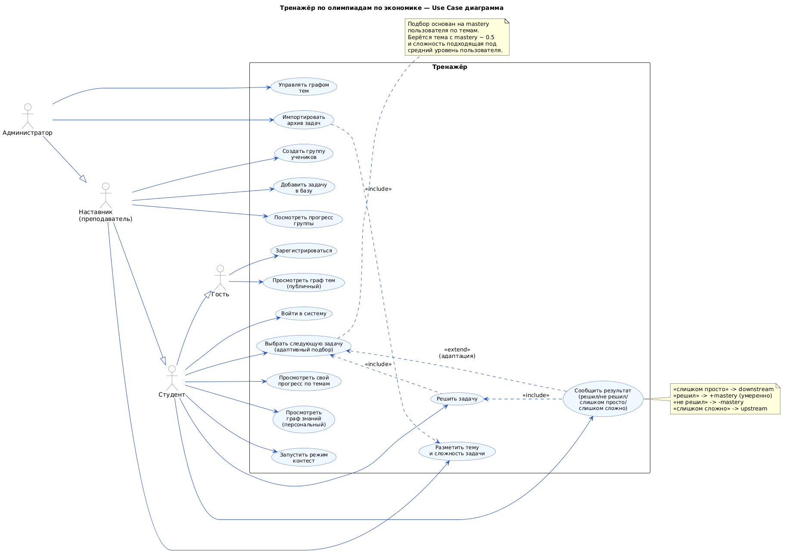
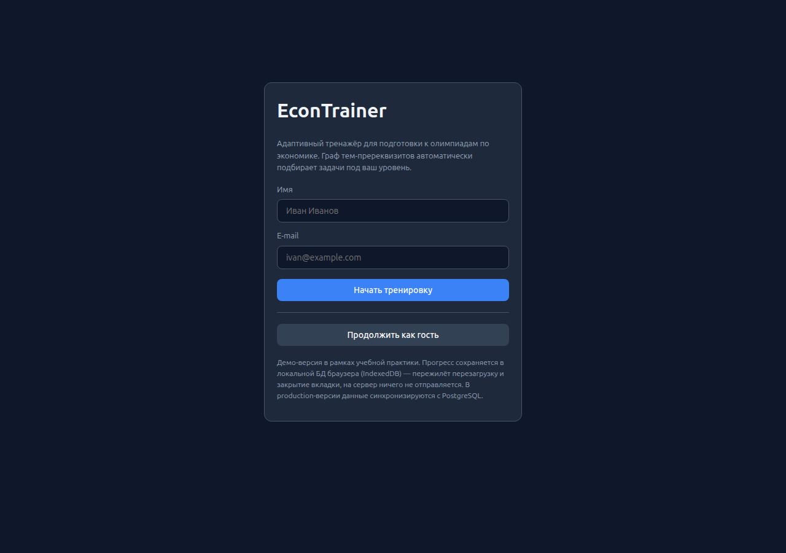
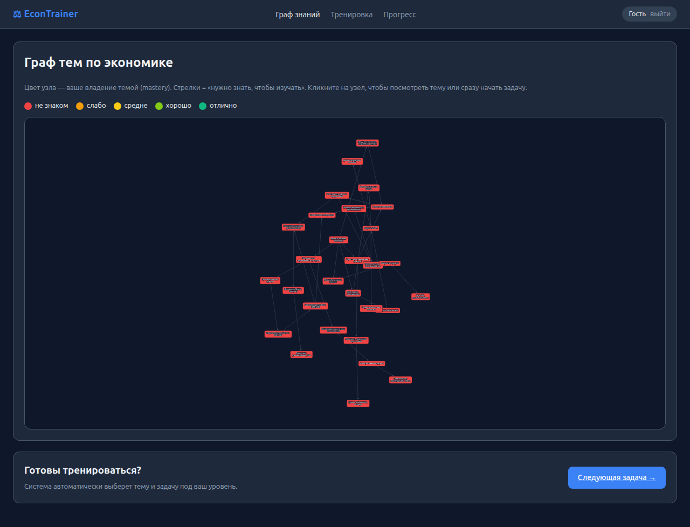
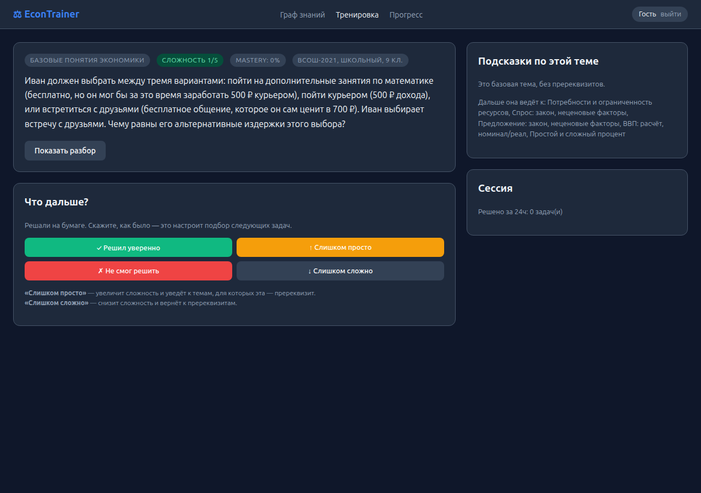
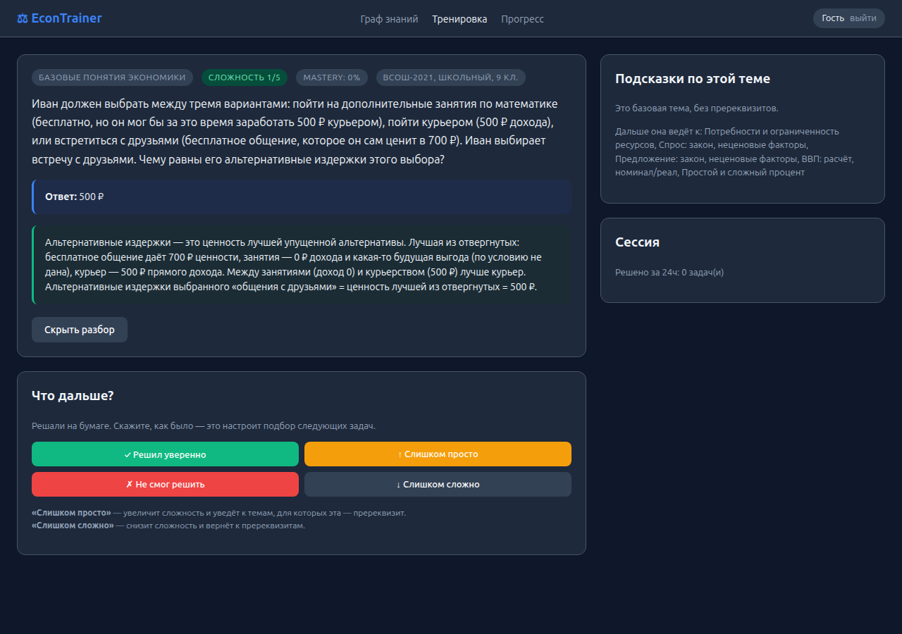
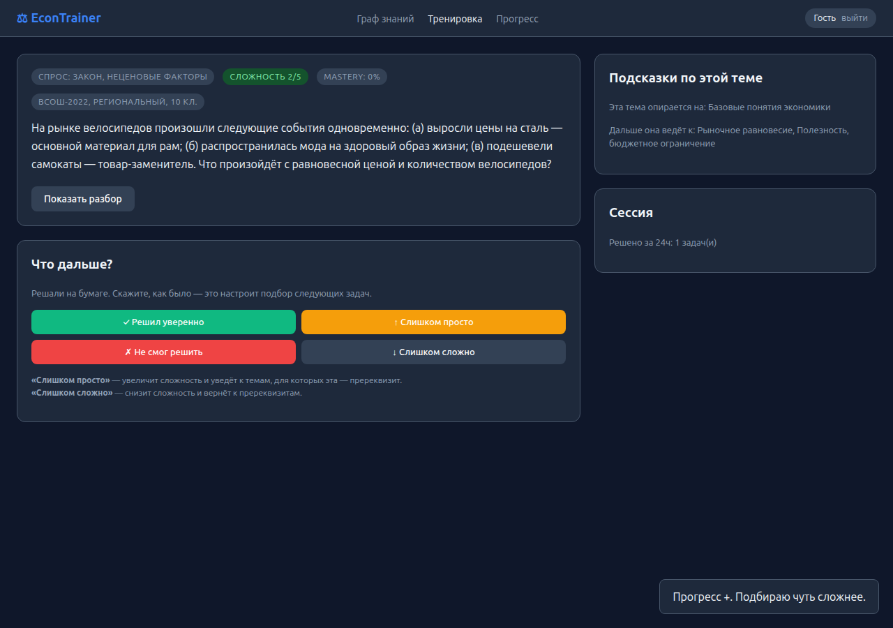
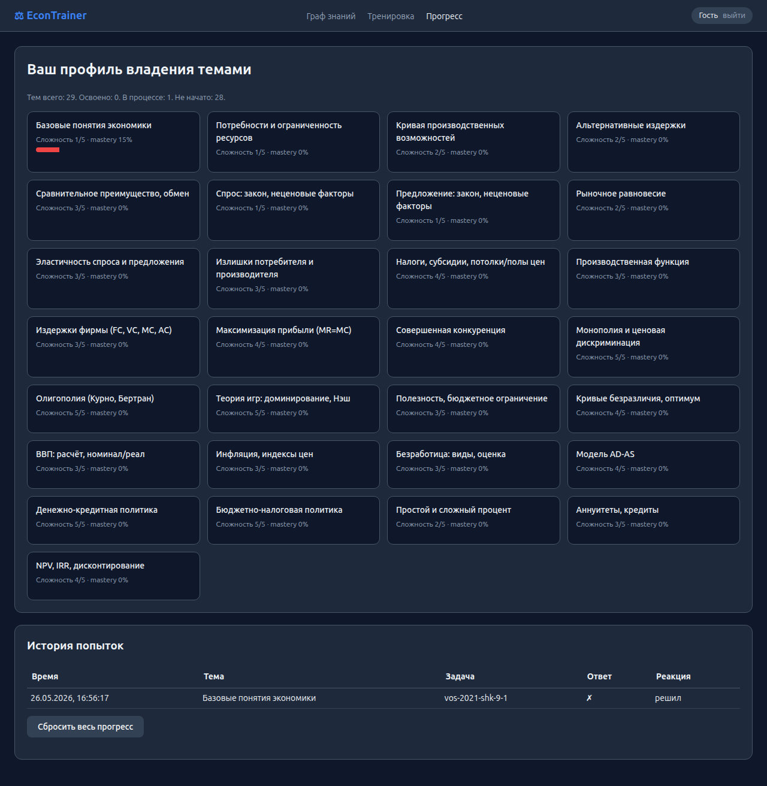

# Отчёт по учебной практике УП.02

**Тема дипломного проекта:**
Адаптивный тренажёр для подготовки к олимпиадам по экономике с
индивидуальным образовательным треком на основе графа тем-пререквизитов.

**Студент:** Горшунов Игорь Станиславович
**Группа:** 09.02.07 ОЗФ
**Руководитель практики:** Баграмов Н.М.
**Период:** учебная практика УП.02, май 2026

**Ключевые ссылки:**
- 🌐 **Развёрнутое приложение:** <https://webapp-xi-smoky-65.vercel.app/>
- 📦 Репозиторий: <https://github.com/igorshunov/econ-olympiad-trainer>
- Архив с исходным кодом: `econ-olympiad-trainer-source.zip`

---

## Содержание

1. [Задание 1. Описание дипломного проекта](#задание-1-описание-дипломного-проекта)
2. [Задание 2. Use-case диаграмма](#задание-2-use-case-диаграмма)
3. [Задание 3. Прототип и веб-приложение](#задание-3-прототип-и-веб-приложение)
4. [Структура репозитория](#структура-репозитория)

---

## Задание 1. Описание дипломного проекта

См. отдельный документ — `docs/diploma-description.md`.
Кратко: реализуется веб-приложение, в котором пользователь, готовящийся
к олимпиаде по экономике, получает индивидуальный поток задач. Темы
организованы в виде направленного графа пререквизитов (рёбра «A нужно
знать, чтобы изучать B»). Сервис оценивает владение каждой темой
(mastery 0..1) и подбирает следующую задачу из темы в зоне ближайшего
развития. После каждой задачи пользователь даёт обратную связь
(«решил» / «не смог» / «слишком просто» / «слишком сложно») — этот
ответ корректирует mastery и определяет тему и сложность следующей
задачи.

**Целевая аудитория:** старшеклассники (10-11 кл.) и студенты 1-2 курса,
готовящиеся к ВсОШ, «Высшей Пробе» НИУ ВШЭ, «Ломоносову» МГУ.

**Используемые технологии (предварительно):**
| Слой | Технология | Обоснование |
|------|------------|-------------|
| Frontend | vanilla HTML5/CSS3/ES2022, Cytoscape.js | Минимум зависимостей, лёгкий деплой |
| Хранилище клиента (MVP) | **IndexedDB** через `idb-keyval` | Реальная локальная БД, persist между сессиями |
| Backend (план) | Python 3.11 + FastAPI + SQLAlchemy 2.x | Типизация, быстрая разработка |
| СУБД (план) | PostgreSQL 16 | Реляционная модель с CTE и оконными функциями |
| Аутентификация (план) | JWT + bcrypt | Стандарт |
| Деплой фронта | **Vercel** | CDN, мгновенный деплой, бесплатно |
| Деплой бэка (план) | Render.com / Yandex Cloud | Free-tier |

## Задание 2. Use-case диаграмма

Диаграмма построена в соответствии с UML-нотацией, описанной в статье
"Использование диаграммы вариантов использования UML"
(https://habr.com/ru/articles/566218/):

- **Ассоциация** (актёр — use-case): сплошная линия без стрелки;
- **Обобщение** (наследование акторов): сплошная линия с треугольной стрелкой к родителю;
- **Включение** `<<include>>`: пунктирная стрелка из включающего в включаемый;
- **Расширение** `<<extend>>`: пунктирная стрелка из расширяющего в базовый;
- Use-cases заключены в прямоугольник — **границу системы**, акторы вне него.



**Акторы** (с наследованием):
- Гость → Студент → Наставник → Администратор.
- Каждый следующий уровень имеет всё, что и предыдущий, плюс свои use-cases.

**Use-cases:**
- *Гость*: «Просмотреть граф тем» (публичный), «Зарегистрироваться»;
- *Студент*: «Войти в систему», «Тренироваться», «Просмотреть прогресс», «Запустить контест»;
- *Наставник*: «Создать группу учеников», «Прогресс группы», «Добавить задачу», «Разметить тему/сложность»;
- *Администратор*: «Управлять графом тем», «Импортировать архив задач».

**Ключевые отношения:**
- «Тренироваться» `<<include>>` «Получить следующую задачу» + «Прочитать условие и решить» + «Сообщить результат» — три обязательных шага;
- «Импортировать архив» `<<include>>` «Разметить тему/сложность» — невозможно без разметки;
- «Посмотреть разбор» `<<extend>>` «Прочитать условие и решить» — необязательное расширение основного use-case.

## Задание 3. Прототип и веб-приложение

### Развёрнутое приложение

🌐 **<https://webapp-xi-smoky-65.vercel.app/>**

Развёрнуто на Vercel (CDN, HTTPS). Открывается мгновенно, JS-логика
работает в браузере, прогресс сохраняется в локальной БД браузера
(**IndexedDB**), на сервер ничего не отправляется.

### Структура и страницы

Приложение состоит из **четырёх страниц** (требование задания — минимум 3):

1. **`index.html`** — экран логина (имя + e-mail) с альтернативой «Продолжить как гость»;
2. **`dashboard.html`** — главный экран с интерактивным графом тем (Cytoscape.js);
3. **`task.html`** — экран тренировки: условие задачи, источник
   (например, ВсОШ-2021), кнопка «Показать разбор», 4 кнопки фидбека;
4. **`progress.html`** — карточка прогресса по 29 темам + журнал попыток.

### Скриншоты (production)

**Экран логина** (страница 1):



**Граф тем** (страница 2) — у нового пользователя все узлы красные
(mastery=0); по мере «решений» узлы зеленеют:



**Решение задачи** (страница 3) — задача из ВсОШ-2021, школьный этап, 9 кл.
Слева — условие, кнопка «Показать разбор» и 4 кнопки фидбека; справа —
подсказки о пререквизитах темы и downstream-темах, плюс счётчик сессии:



**Задача после «Показать разбор»** — открылся эталонный ответ
и развёрнутый разбор:



**Следующая задача после «Решил уверенно»** — mastery вырос до 15%,
система перешла к downstream-теме:



**Прогресс** (страница 4) — сетка тем с mastery-баром и журнал попыток:



### Клиентская логика

Адаптивный движок (`webapp/js/engine.js`) — ядро персонализации.
**Логика рекомендации задач:**

```js
function pickNextTopic(prefer, excludeTaskIds) {
  const usable = topicsWithAvailableTasks(excludeTaskIds);
  let candidates = TOPICS.filter(t => isUnlocked(t.id) && usable.has(t.id));
  if (prefer && prefer.startsWith('downstream:')) {
    const from = prefer.slice('downstream:'.length);
    const dns = downstream(from).filter(d => isUnlocked(d) && usable.has(d));
    if (dns.length) candidates = dns.map(topicById);
  }
  // Сортируем по близости mastery к 0.5 (зона ближайшего развития)
  candidates.sort((a, b) =>
    Math.abs(getMastery(a.id) - 0.5) - Math.abs(getMastery(b.id) - 0.5));
  return candidates[0];
}
```

**Запись попытки и обновление mastery:**

```js
async function recordAttempt(taskId, topicId, action, correct) {
  await Storage.appendHistory({ ts: Date.now(), taskId, topicId, action });
  let delta = 0;
  if      (action === 'solved')   delta = +0.15;
  else if (action === 'too_easy') delta = +0.25;
  else if (action === 'failed')   delta = -0.20;
  else if (action === 'too_hard') delta = -0.10;
  await setMastery(topicId, getMastery(topicId) + delta);
  if (action === 'solved' || action === 'too_easy') return 'downstream:' + topicId;
  return 'upstream:' + topicId;
}
```

**Хранение прогресса** (`webapp/js/storage.js`) — через IndexedDB
(`idb-keyval`) с fallback на localStorage. Persist между сессиями
браузера подтверждён E2E-тестом (см. ниже).

### Адаптивность вёрстки

CSS Grid + `@media (max-width: 900px)`:

```css
.task-page { display: grid; grid-template-columns: 2fr 1fr; gap: 20px; }
@media (max-width: 900px) {
  .task-page { grid-template-columns: 1fr; }
}
```

На мобильных страница задачи переключается в одну колонку, sidebar
с подсказками уходит ниже основного блока.

### Семантический HTML

Используются семантические теги: `<header>`, `<main>`, `<nav>`,
`<aside>`, `<form>`, `<button>`, `<table>`, `<h1>...<h3>`. Атрибуты
`lang="ru"`, `viewport`, `charset=utf-8` присутствуют в каждой странице.

### Реальные олимпиадные задачи

В MVP подгружена выборка задач из открытых архивов олимпиад прошлых лет
с указанием источника в каждой задаче:
- ВсОШ по экономике (школьный, региональный, заключительный этапы);
- «Высшая Проба» НИУ ВШЭ;
- Олимпиада МГУ «Ломоносов».

Каждая задача имеет поле `source: { olympiad, stage, year, grade }`,
которое отображается тегом в интерфейсе (например, «ВсОШ-2021, школьный, 9 кл.»).

### E2E-тестирование

Полный сценарий протестирован через **Playwright** против production-URL
(`https://webapp-xi-smoky-65.vercel.app/`). Тест покрывает:

1. Открытие логина → вход как гость → дашборд;
2. Подтверждение, что storage backend = **IndexedDB**;
3. Переход на тренировку, отображение задачи + источника;
4. «Показать разбор» → ответ + разбор;
5. «Решил уверенно» → mastery вырос с 0% до 15%, новая задача из downstream-темы;
6. Открытие журнала, проверка истории попыток;
7. **Reload** страницы → проверка, что IndexedDB реально сохранил данные;
8. «Слишком сложно» → mastery упал, переход к более простой теме;
9. Прямая проверка содержимого IndexedDB через `Storage.getMastery()` / `Storage.getHistory()`.

Все 9 шагов проходят без ошибок. Скрипт E2E прилагается в репозитории
(`e2e_test.py`).

## Структура репозитория

```
econ-olympiad-trainer/
├── README.md
├── index.html                        — редирект на /webapp/
├── webapp/                           — приложение
│   ├── index.html, dashboard.html, task.html, progress.html
│   ├── css/styles.css
│   ├── data/topics.js, tasks.js      — граф тем и реальные олимпиадные задачи
│   └── js/storage.js (IndexedDB), engine.js (адаптивный движок), ui.js
├── database/                         — артефакты УП.11
│   ├── schema.sql, seed.sql, queries.sql
│   ├── er-diagram.puml, er-diagram.png
│   ├── queries_output.txt
│   └── screenshots/                  — скриншоты структуры таблиц
├── docs/
│   ├── diploma-description.md        — описание дипломного проекта
│   ├── use-case.puml, use-case.png   — UML use-case
│   └── screenshots/                  — скриншоты страниц (prod_e2e_*.png)
├── reports/
│   ├── up02_report.md, up02_report.pdf
│   └── up11_report.md, up11_report.pdf
└── e2e_test.py                       — E2E тест через Playwright
```

## Самооценка по критериям

| Задание | Критерий | Самооценка | Подтверждение |
|---|---|---|---|
| 1 | Актуальность темы (5 б) | + | раздел «Актуальность» в описании |
| 1 | Целевая аудитория (4 б) | + | раздел «Целевая аудитория» |
| 1 | Функционал (5 б) | + | детальный разбор основных и расширенных функций |
| 1 | Технологии (4 б) | + | таблица стека |
| 1 | Ожидаемый результат (5 б) | + | раздел «Ожидаемый результат» |
| 1 | Структура документа (2 б) | + | разбит на 5 разделов с заголовками |
| 2 | Соответствие проекту (4 б) | + | use-cases соответствуют функциям |
| 2 | Акторы (5 б) | + | 4 актора с наследованием |
| 2 | Полнота use-cases (6 б) | + | 16 use-cases, покрывают все группы |
| 2 | UML-нотация (4 б) | + | по статье с habr (ассоциация без стрелки, include/extend) |
| 2 | Логичность и читаемость (4 б) | + | use-cases сгруппированы по акторам |
| 2 | Аккуратность (2 б) | + | подсветка, рамка системы, note |
| 3.1 | 3-5 страниц прототипа (4 б) | + | 4 страницы |
| 3.1 | Логичная навигация (3 б) | + | header с nav, переходы по графу |
| 3.1 | UX (3 б) | + | подсказки, 4 кнопки фидбека, toast-сообщения |
| 3.2 | Не менее 3 страниц (5 б) | + | 4 страницы |
| 3.2 | Соответствие верстки (5 б) | + | dark-theme дизайн, согласованный |
| 3.2 | Семантическая HTML (4 б) | + | header/main/nav/aside/h1-h3 |
| 3.2 | Корректность кода (3 б) | + | проверено через E2E, нет ошибок в консоли |
| 3.2 | Адаптивность (3 б) | + | `@media (max-width: 900px)` |
| 3.3 | Работающая JS-логика (5 б) | + | engine.js — адаптивный движок |
| 3.3 | Логика соответствует проекту (3 б) | + | mastery + downstream/upstream traversal |
| 3.3 | Код аккуратный (2 б) | + | модули storage/engine/ui, без глобалов |
| 3.4 | Скриншоты прототипа (3 б) | ⏺ | опционально, не делал отдельный макет |
| 3.4 | Скриншоты HTML-страниц (3 б) | + | 6 скриншотов с production |
| 3.4 | Архив с исходным кодом (4 б) | + | econ-olympiad-trainer-source.zip + публичный репозиторий |
