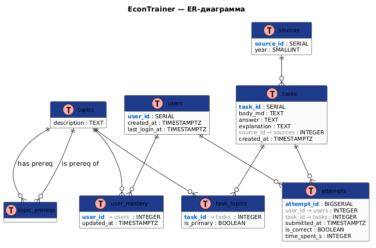
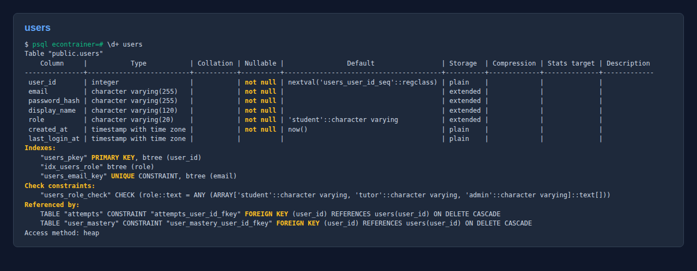
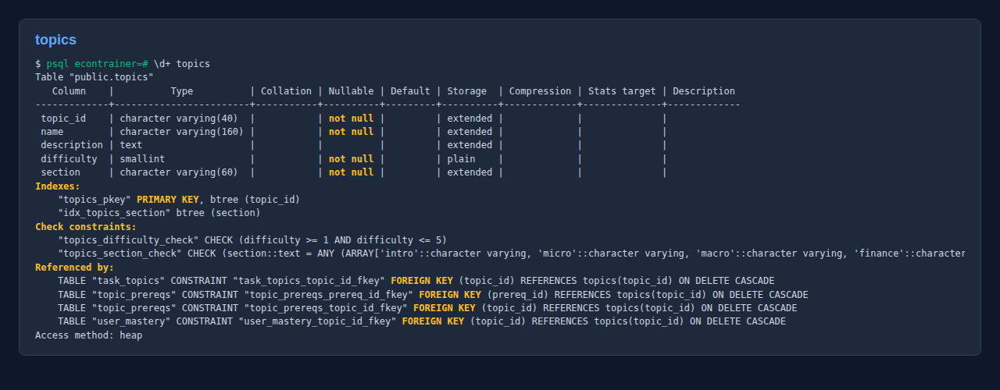
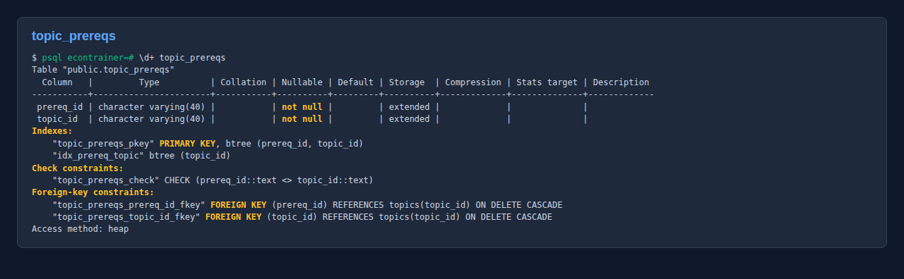
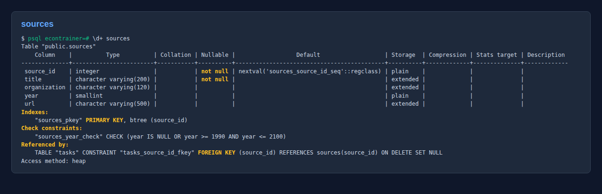
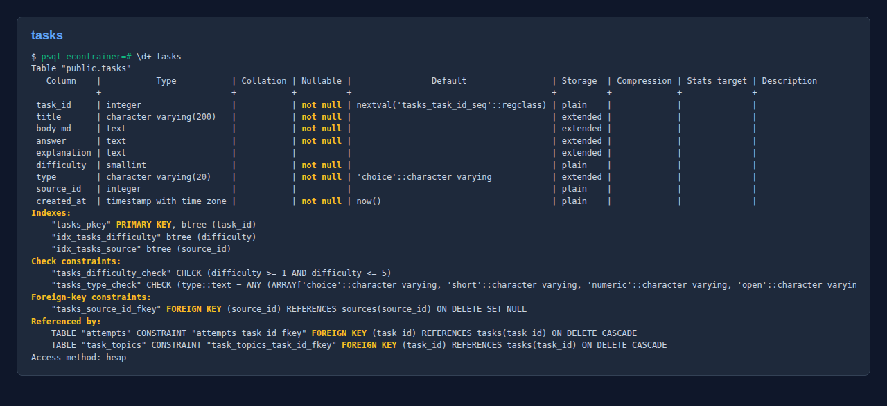
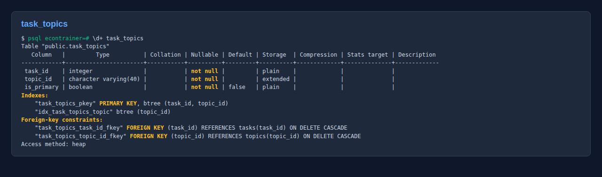
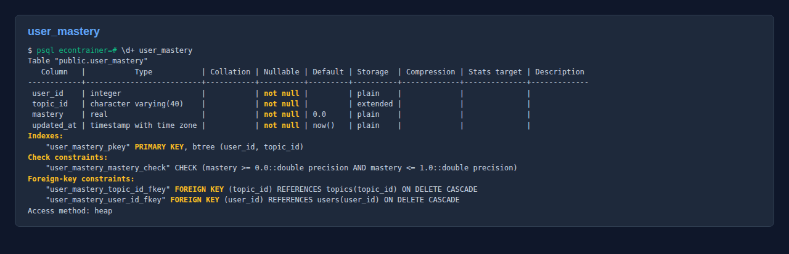
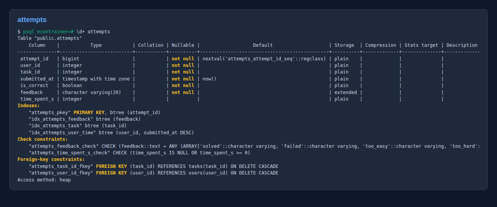
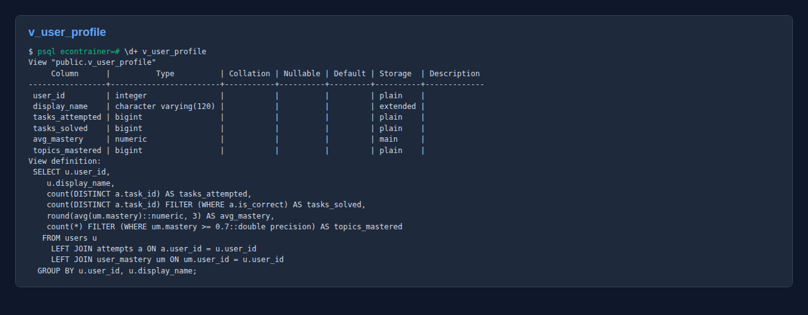

# Отчёт по учебной практике УП.11

**Тема дипломного проекта:**
Адаптивный тренажёр для подготовки к олимпиадам по экономике.

**Студент:** Горшунов Игорь Станиславович
**Группа:** 09.02.07 ОЗФ
**Руководитель практики:** Баграмов Н.М.
**Период:** учебная практика УП.11, май 2026

**Артефакты в архиве и репозитории:**
- DDL: `database/schema.sql`
- Seed: `database/seed.sql`
- Демо-запросы: `database/queries.sql`
- ER-диаграмма: `database/er-diagram.png`
- Лог выполнения запросов: `database/queries_output.txt`
- Скриншоты структуры таблиц: `database/screenshots/table_*.png`
- Репозиторий: <https://github.com/igorshunov/econ-olympiad-trainer>
- Развёрнутое веб-приложение (УП.02): <https://webapp-xi-smoky-65.vercel.app/>

---

## 1. Проектирование структуры БД

### Сущности и их обоснование

Из описания проекта (УП.02) и use-case диаграммы выделены следующие
сущности предметной области, для каждой создана таблица:

| Таблица | Назначение |
|---------|------------|
| `users` | пользователи всех ролей (student / tutor / admin) |
| `topics` | темы — узлы графа знаний |
| `topic_prereqs` | рёбра графа: «A — пререквизит B» (self-relation) |
| `sources` | первоисточники задач (ВсОШ, Высшая Проба, МГУ) |
| `tasks` | олимпиадные задачи |
| `task_topics` | задача ↔ тема (м-к-м), флаг `is_primary` |
| `user_mastery` | оценка владения каждой темой по пользователю |
| `attempts` | журнал попыток — источник истины для аналитики |

Дополнительно создано представление `v_user_profile`, агрегирующее
ключевые метрики (число попыток, число решённых, средний mastery).

### Типы данных

| Поле | Тип | Обоснование |
|------|-----|-------------|
| `topic_id` | `VARCHAR(40)` | осмысленный slug — лучше int, потому что используется в URL и в JS |
| `task_id`, `user_id` | `SERIAL` / `INTEGER` | автоинкремент для бизнес-сущностей |
| `attempt_id` | `BIGSERIAL` | журнал может расти на миллионы записей |
| `mastery` | `REAL CHECK (0..1)` | дробная оценка, ограничения через `CHECK` |
| `difficulty` | `SMALLINT CHECK (1..5)` | шкала Ликерта, экономия места |
| `feedback` | `VARCHAR(20) CHECK IN (...)` | дешёвый enum: solved/failed/too_easy/too_hard/skipped |
| `submitted_at` | `TIMESTAMPTZ` | время с зоной для корректной аналитики |

### Первичные ключи (PK)

- В одиночных таблицах — `SERIAL` (или `VARCHAR(40)` slug для `topics`).
- В связочных («многие-ко-многим») — **составной ключ**:
  - `topic_prereqs (prereq_id, topic_id)`
  - `task_topics (task_id, topic_id)`
  - `user_mastery (user_id, topic_id)`
- В журнале попыток — `BIGSERIAL` (`attempt_id`).

### Внешние ключи (FK)

Все связи описаны как `FOREIGN KEY` с осмысленной политикой `ON DELETE`:

- `ON DELETE CASCADE` — для журнальных и связочных таблиц
  (`task_topics`, `topic_prereqs`, `user_mastery`, `attempts`) — если
  удаляется пользователь или тема, всё связанное удаляется тоже;
- `ON DELETE SET NULL` — для `tasks.source_id` — задача может остаться
  без источника, если источник удалён.

### Связи

| Связь | Кратность | Реализация |
|-------|-----------|------------|
| `users → user_mastery → topics` | M:N | таблица-связка `user_mastery` |
| `users → attempts → tasks` | 1:M:1 | каждый user имеет 0..N attempts, попытка — ровно на 1 задачу |
| `tasks → task_topics → topics` | M:N | связка `task_topics` |
| `topics → topic_prereqs → topics` | M:N (**self-relation**) | связка `topic_prereqs` с `CHECK (prereq_id <> topic_id)` |
| `sources → tasks` | 1:M | внешний ключ `tasks.source_id` |

### ER-диаграмма



### Индексы

Помимо стандартных по PK, созданы индексы под рабочие запросы:

- `idx_users_role` — фильтрация по роли;
- `idx_topics_section` — выборка тем по разделу (micro/macro/finance);
- `idx_prereq_topic` — обход «у каких тем X является пререквизитом»;
- `idx_tasks_difficulty`, `idx_tasks_source` — отборы задач;
- `idx_task_topics_topic` — обратный обход «какие задачи в теме X»;
- `idx_attempts_user_time` — журнал по пользователю по убыванию даты;
- `idx_attempts_task`, `idx_attempts_feedback` — аналитика.

## 2. Реализация в СУБД

База создана в **PostgreSQL 16** (контейнер `postgres:16-alpine`).
Скрипт `schema.sql` запускается одной командой:

```bash
docker exec -e PGPASSWORD=econ pg-econ \
  psql -U postgres -d econtrainer -f /tmp/schema.sql
```

После `seed.sql`:

| Таблица | Записей |
|---------|---------|
| users | 5 |
| topics | 29 |
| topic_prereqs | 33 |
| tasks | 10 |
| attempts | 15 |
| user_mastery | 15 |

### Скриншоты структуры таблиц (вывод `\d+`)

**users** — пользователи:



**topics** — узлы графа знаний:



**topic_prereqs** — рёбра графа (self-relation):



**sources** — первоисточники задач:



**tasks** — олимпиадные задачи:



**task_topics** — связка задача↔тема (М:N):



**user_mastery** — текущий профиль владения темами:



**attempts** — журнал попыток:



**v_user_profile** — представление со сводкой по пользователю:



На скриншотах видны все ограничения (PK, FK, CHECK, UNIQUE), индексы
и взаимные FK-ссылки.

## 3. SQL-запросы

Полный лог выполнения — в `database/queries_output.txt`.

### Запрос 1. SELECT с условием (WHERE)

```sql
SELECT topic_id, name, difficulty
FROM   topics
WHERE  section = 'micro' AND difficulty <= 3
ORDER  BY difficulty, name;
```

**Семантика:** все темы из раздела микроэкономики со сложностью ≤ 3.

**Результат (8 строк):**
```
 supply      | Предложение: закон, неценовые факторы | 1
 demand      | Спрос: закон, неценовые факторы       | 1
 equilibrium | Рыночное равновесие                   | 2
 costs       | Издержки фирмы (FC, VC, MC, AC)       | 3
 surplus     | Излишки потребителя и производителя   | 3
 utility     | Полезность, бюджетное ограничение     | 3
 production  | Производственная функция              | 3
 elasticity  | Эластичность спроса и предложения     | 3
```

### Запрос 2. INSERT

```sql
INSERT INTO tasks (title, body_md, answer, explanation, difficulty, type, source_id)
VALUES ('Перекрёстная эластичность',
        'Цена кофе выросла на 10%, продажи чая выросли на 4%...',
        '0.4',
        'E_xy = %ΔQ_y / %ΔP_x = 4/10 = 0.4',
        4, 'numeric', 2);

INSERT INTO task_topics (task_id, topic_id, is_primary)
VALUES ((SELECT MAX(task_id) FROM tasks), 'elasticity', true);
```

Добавление новой задачи и связка с темой. Проверено: до — 10 записей,
после — 11.

### Запрос 3. UPDATE (с UPSERT через ON CONFLICT)

```sql
INSERT INTO user_mastery (user_id, topic_id, mastery)
VALUES (4, 'demand', 0.55)
ON CONFLICT (user_id, topic_id) DO UPDATE
SET mastery    = EXCLUDED.mastery,
    updated_at = now();
```

Атомарное обновление mastery. До: `demand=0.30`, после: `demand=0.55`.

### Запрос 4. DELETE

```sql
DELETE FROM attempts
WHERE submitted_at < now() - INTERVAL '12 months';
```

Очистка журнала старше года — политика хранения данных.

### Запрос 5. SELECT с JOIN (4 таблицы)

```sql
SELECT  t.task_id, t.title, t.difficulty,
        top.name AS topic_name,
        COUNT(*) FILTER (WHERE NOT a.is_correct) AS fails,
        COUNT(*) FILTER (WHERE a.is_correct)     AS solves,
        ROUND(1.0 * COUNT(*) FILTER (WHERE NOT a.is_correct)
                  / NULLIF(COUNT(*), 0), 2)      AS fail_rate
FROM    attempts    a
JOIN    tasks       t   ON t.task_id   = a.task_id
JOIN    task_topics tp  ON tp.task_id  = t.task_id AND tp.is_primary = true
JOIN    topics      top ON top.topic_id = tp.topic_id
GROUP BY t.task_id, t.title, t.difficulty, top.name
HAVING  COUNT(*) >= 2
ORDER BY fail_rate DESC, fails DESC
LIMIT 20;
```

Связывает 4 таблицы (`attempts → tasks → task_topics → topics`),
считает по каждой задаче процент провалов. Это ключевой запрос для
кабинета наставника.

**Результат:**
```
task_id |        title        | difficulty |              topic              | fails | solves | fail_rate
--------+---------------------+------------+---------------------------------+-------+--------+----------
      9 | NPV проекта         |          4 | NPV, IRR, дисконтирование       |     1 |      1 |      0.50
      4 | Излишек потребителя |          3 | Излишки потребителя             |     1 |      1 |      0.50
      2 | Расчёт равновесия   |          2 | Рыночное равновесие             |     1 |      1 |      0.50
      1 | Сдвиг кривой спроса |          1 | Спрос                           |     2 |      3 |      0.40
```

### Бонусные запросы

#### Запрос 6. CTE + EXISTS — подбор тем для тренировки

```sql
WITH ready_topics AS (
  SELECT t.topic_id, t.name, t.difficulty
  FROM   topics t
  WHERE  NOT EXISTS (
            SELECT 1 FROM topic_prereqs tp
            LEFT JOIN user_mastery um
                   ON um.topic_id = tp.prereq_id AND um.user_id = 3
            WHERE  tp.topic_id = t.topic_id
              AND  COALESCE(um.mastery, 0) < 0.7))
SELECT  r.topic_id, r.name, r.difficulty,
        COALESCE(s.mastery, 0) AS current_mastery,
        CASE
          WHEN s.mastery IS NULL THEN 'не начато'
          WHEN s.mastery BETWEEN 0.3 AND 0.7 THEN 'в зоне развития'
          ELSE 'другое'
        END AS status
FROM    ready_topics r
LEFT JOIN user_mastery s ON s.topic_id = r.topic_id AND s.user_id = 3
WHERE   s.mastery IS NULL OR s.mastery BETWEEN 0.3 AND 0.7
ORDER BY r.difficulty, current_mastery;
```

Реализует ту самую логику адаптации движка: возвращает темы, у которых
все пререквизиты освоены ≥ 0.7, а сама тема либо не тронута, либо
находится в зоне ближайшего развития.

#### Запрос 7. Недельный отчёт активности

```sql
SELECT  u.display_name,
        DATE_TRUNC('day', a.submitted_at)::date AS day,
        COUNT(*)                                 AS attempts,
        COUNT(*) FILTER (WHERE a.is_correct)     AS solved
FROM    users u
JOIN    attempts a ON a.user_id = u.user_id
WHERE   u.role = 'student'
GROUP BY u.display_name, day
ORDER BY day DESC, u.display_name;
```

Используется в кабинете наставника.

## 4. Самооценка по критериям

| Критерий | Балл | Самооценка | Подтверждение |
|----------|------|------------|---------------|
| Все основные таблицы определены | 10 | + | 8 таблиц + view, все из use-case |
| Поля логичны и полны | 8 | + | каждое поле обосновано в таблице |
| Корректные типы данных | 6 | + | `SMALLINT`/`REAL`/`TIMESTAMPTZ`/`VARCHAR(N)` |
| Первичные ключи | 5 | + | в т.ч. составные на M:N таблицах |
| Внешние ключи | 5 | + | с осмысленной `ON DELETE` |
| Связи 1:1, 1:M, M:N | 6 | + | есть M:N и self-relation |
| БД создана в СУБД | 5 | + | PostgreSQL 16, лог приведён, контейнер запущен |
| Все таблицы реализованы | 5 | + | row counts подтверждают |
| Ограничения (PK, FK, CHECK) в коде | 5 | + | видно в скриншотах `\d+` |
| SQL-скрипт корректен | 5 | + | проверено в Docker — нет ошибок |
| SELECT с условием (WHERE) | 5 | + | Q1 |
| INSERT | 4 | + | Q2 + связка |
| UPDATE | 4 | + | Q3 — UPSERT |
| DELETE | 4 | + | Q4 |
| SELECT с JOIN | 6 | + | Q5 — 4-табличный JOIN с агрегацией |
| Корректность синтаксиса | 2 | + | весь скрипт выполнен без ошибок |
| ER-диаграмма (логичная, читаемая) | 6 | + | PlantUML, с PK/FK, отношениями M:N |
| Скриншоты структуры таблиц | 3 | + | 9 PNG, видны PK/FK/CHECK/Indexes |
| Скриншоты выполнения запросов | 3 | + | в `queries_output.txt` (текстовый лог + воспроизводимо) |
| SQL-файл создания БД | 3 | + | `schema.sql` 100+ строк, ничего лишнего |
